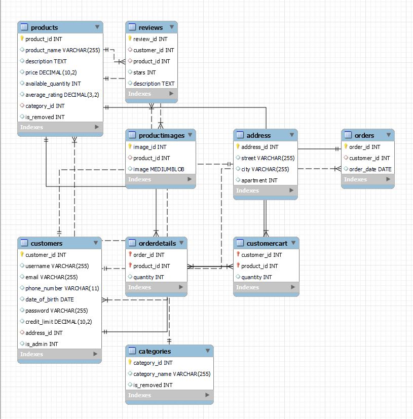

<div align="center">

  
  <h1>Welcome to MyDeal Shopping website 👋</h1>
</div>

<br />  
<br>

<!-- About the Project -->
## :star2: About the Project

**MyDeal** is a web application designed to provide a comprehensive platform for managing an online store. With a focus on user experience and administrative control, the system offers a wide range of features to facilitate smooth operation and efficient management of the e-commerce business. The application caters to both end-users and system administrators, offering distinct functionalities tailored to their respective needs.

<br>

<!-- Features -->
### :dart: Features

### 🛡️ User Authentication and Authorization:
- Upon signing in, users are redirected based on their privileges.
- System administrators have exclusive access to certain functionalities.

### 🚀 System Administrator Privileges:
- **Manage products:**
  - View, add, edit, and remove product prices and quantities.
- **Review customer profiles.**

### 👤 User Actions:
- **Sign Up:**
  - Enter profile data (name, birthday, password, job, email, credit limit, address, interests, etc.).
- **Sign In:**
  - Use email and password for subsequent visits.
- **Profile Management:**
  - Edit profile information.
- **Product Viewing:**
  - Browse all available products.
- **Product Categorization:**
  - Organize products into categories.
- **Shopping Cart:**
  - Add/remove products to/from the shopping cart.
- **Purchase:**
  - Buy products within the credit limit.
- **Credit Limit Management:**
  - Set during sign-up and can be updated later by the user.
- **Order Completion:**
  - Update the user's credit limit and product quantities after completing a purchase.
  - Reset the user's shopping cart.
<br>

### Database Schema


<!-- TechStack -->
### 🛠️ Technologies Used


[](https://developer.mozilla.org/en-US/docs/Web/Guide/HTML/HTML5)
	
 
 
 
 
 


<br>

<!-- Getting Started -->
## 	:toolbox: Getting Started

1. **Clone the Repository**: Clone the Void Chat App repository from [GitHub](https://github.com/Mohamed-Adel2/MyDeal).
   
    ```
    git clone https://github.com/Mohamed-Adel2/MyDeal
    ```

2. **Set Up MySQL Database**: Set up a MySQL database using the DB_Schema.sql file.

3. **Build and Run**: Use Maven to build the application and download the dependency, then run the server and the client (run: mvn install tomcat7:deploy).

4. **Register and Log In**: Register as client and login.

5. **Explore Features**:  Explore the various features of the application, such as user authentication, product management, shopping cart functionality, and profile editing. Familiarize yourself with the different actions available to users, including signing up, signing in, browsing products, categorizing products, and making purchases within the credit limit.

<br>

## 🚀 Contributors

- [Mohamed Adel](https://github.com/Mohamed-Adel2)
- [Rashida Mohamed](https://github.com/Rashida5)
- [Mohamed Amgad](https://github.com/AMG2001)

<br>

## :wave: Contributing

Contributions to the <b>MyDeal<b> are welcome! Feel free to submit a pull request or open an issue on GitHub if you have any ideas for improvements or new features.

---

Feel free to reach out if you have any questions or need further assistance!
